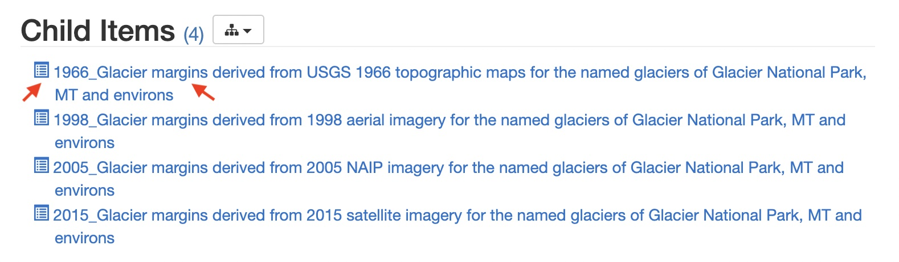

Before we can understand the topology of data, we need to get some interesting data to work with.
For this tutorial we will use GIS data from Glacier National Park in Northwestern Montana.
The data can be downloaded from the USGS at [this address](https://www.sciencebase.gov/catalog/item/58af7022e4b01ccd54f9f542).

Let's begin by downloading the data from 1966:



For fun, click around a bit with the data you've downloaded. It is in shapefile format, which can be 
viewed with GIS software. One easy way to do this is with Google Earth. Google Earth Pro is free to 
download, and you import shapefiles (on Mac) with

```
file -> import
```

